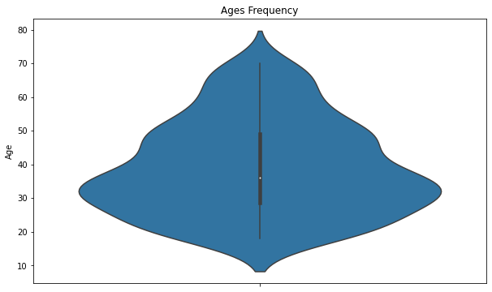
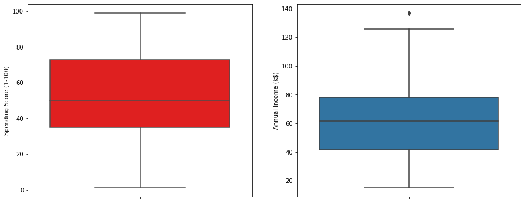
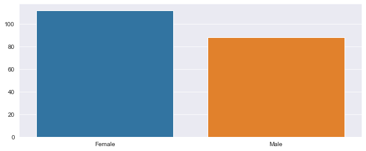
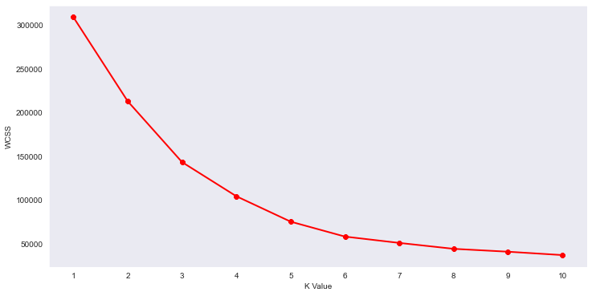

### customer-segmentation

Customer segmentation is the process of grouping customers together based on common characteristics. These customer groups are beneficial in marketing campaigns, in identifying potentially profitable customers, and in developing customer loyalty.

Common types of customer segmentation include:

- Demographic segmentation

- Geographic segmentation

- Behavioural segmentation

- Psychographic segmentation

  

The dataset used for this  project is  [Mall Customer Segmentation Data](https://www.kaggle.com/vjchoudhary7/customer-segmentation-tutorial-in-python)

Different attributes were plotted to derive valuable information for segmentation of the data.

- A violin plot was made to show the age frequency of the customers. The plot shows the average age of the customer to be between 35-40 years of age.

​               

- To better visualize the distribution range a box plot was made of spending score and annual income.The range of spending score is clearly more than the annual income range.

  

- The distribution of male and female population in the dataset was visualised by a bar plot.The female population clearly outweighs the male counterpart.

  

The task to categorize the customers into groups was achieved using the kMeans algorithm; an unsupervised learning algorithm.

#### K Means Clustering Algorithm

- Specify number of clusters *K*.

- Initialize centroids by first shuffling the dataset and then randomly selecting *K* data points for the centroids without replacement.

- Keep iterating until there is no change to the centroids. i.e assignment of data points to clusters isn’t changing.

To figure out the optimal number of clusters value, Within Cluster Sum Of Squares (WCSS) was plotted against the number of clusters(K value).WCSS measures sum of distances of observations from their cluster centroids which is given by the below formula.

where *Yi* is centroid for observation *Xi*. The main goal is to maximize number of clusters and in limiting case each data point becomes its own cluster centroid.

#### The Elbow Method

Calculate the Within Cluster Sum of Squared Errors (WSS) for different values of k, and choose the k for which WSS first starts to diminish. In the plot of WSS-versus k, this is visible as an elbow.

The optimal K value is found to be 5 using the elbow method.

#### Result

A 3D plot was made to visualize the spending score of the customers with their annual income. The data points are separated into 5 classes which are represented in different colours as shown in the 3D plot.

.png)